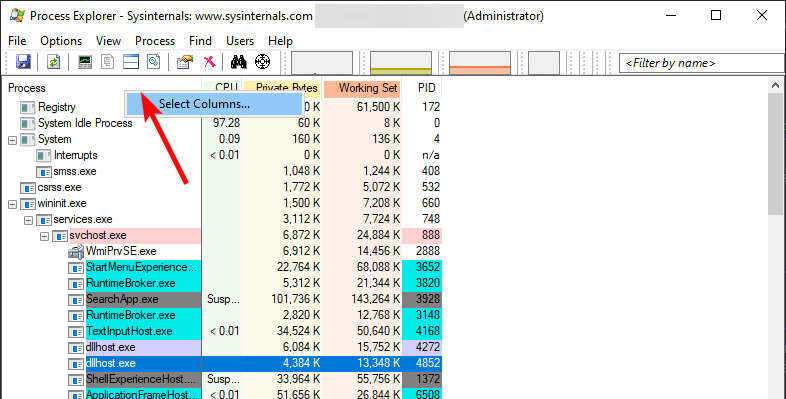
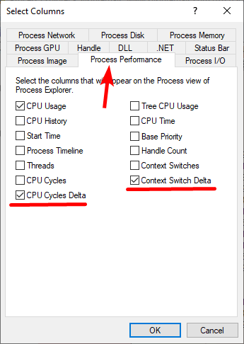
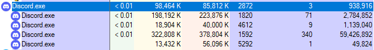
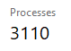

Throughout my time within the tweaking community I have seen an uncomfortably large amount of people who care WAY too much about their process count in Task Manager and break core functionality for a lower process count.

Two much more important metrics to look at are "Cycles Delta" and "Context Switches Delta".

## What is a cycles delta?

In simple terms, cycles delta a metric for how many [cycles](https://www.youtube.com/watch?v=Z5JC9Ve1sfI) are used in a certain amount of time (usually 1 second).

What you need to know is that more cycles, equates (generally) more CPU usage, which means (again, generally) less performance for your games.

## Alright, what about context switches?

Context switches are an **expensive** task which saves and stores the state of a thread or process often used when multitasking and interrupt handling.

> If that is hard to understand you could think of it as pausing a video while you get some water. But context switching is more like pausing a video, writing everything that was said in it on a piece of paper, grabbing some water and then reading the entire paper again. To resume the video.

## How can I check these?

You can use either [Process Explorer](https://docs.microsoft.com/en-us/sysinternals/downloads/process-explorer) or [Process Hacker](https://processhacker.sourceforge.io/), both work.

You'll need to edit the columns to include both cycles delta and context switches delta. Like so:





With those options enabled you can now view cycles delta and context switches delta per process. For example:



## Why it matters

I wrote a quick program that uses basically as many cycles as possible:
```rust
// Rust, i know
fn main() {
    // Create a new instance for each cpu
    for _ in 0..num_cpus::get() {
        std::thread::spawn(move || loop {});
    }
    loop {} // keep main thread alive, else it will exit
}
```

> That's 50 BILLION cycles delta, comparable to over 1,000 discord instances.

This is just an edge case, where I can't even launch a game because the system locks up ??. But it goes to show that a **single** process can be just as detrimental as 50 stupid web apps...

### What about the opposite?

Then just for the fun of it, I spawned 3000+ processes that did absolutely nothing but sleep.. and as expected, I could play games perfectly fine.



# Summary

Don't waste your time breaking functionality just to boast a low number in task manager. *Even after all of that lowering of process counts I see people with browsers and 5 other electron apps open while gaming...*